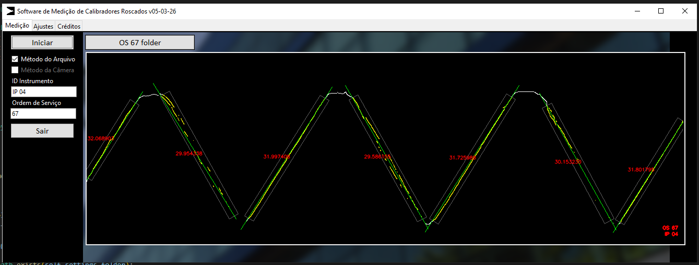

# Software de Medição de Calibradores Roscados

Este software foi desenvolvido para o uso de medição do ângulo de flancos de calibradores roscados externos cilíndricos ou cônicos. Além de exibir o resultado, o software armazena a imagem capturada com os resultados em uma pasta de arquivos determinada pelo usuário.

O algoritmo de detecção espera uma Região de Interesse (ROI) determinada pelo usuário, realiza transformações de cores na imagem, depois aplica um Canny, busca por segmentos de pixels que formam linhas e finalmente calcula o ângulo entre segmentos distintos, donde os pontos para formar as linhas são ajustados por regressão linear. Erros de execução são interceptados pelo Exceptions.py.

Para usar o software, é necessário saber qual é a relação entre a resolução de sua câmera e o comprimento real, tilizando a equação comprimento/pixels. Utilize uma Lupa graduada com padrões rastreáveis ao SI para determinar o valor de {SÍMBOLO}. Os softwares auxiliares disponíveis e descritos abaixo fornecem resultados para o cálculo da constante {SÍMBOLO}

{INSERIR FIGURA DA EQUAÇÃO}

## Programa para Medição de Pixel - Comprimento

{TEXTO DE APRESENTAÇÃO}
{IMAGEM}

## Programa para Medição de Pixel - Ângulo

{TEXTO DE APRESENTAÇÃO}
{IMAGEM}
